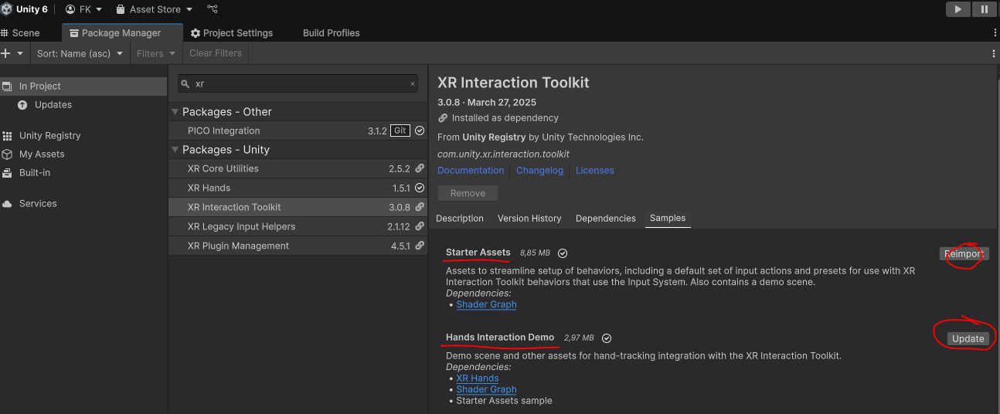

[ tbc ]  
# EDIA EYE Pico 

Eye tracking support for the PICO headsets (PICO 4E, not tested for other headsets) 


## Setting up an empty project with `EDIA Eye PICO`
### Prerequisites
1. Install (from The Unity Registry): 
   1. `XR Interaction Toolkit` (XRI) 
   2. `XR Hands`  
   > <details>
   >
   > <summary>Img</summary>  
   >
   > 
   > </details>
2. Import relevant `Samples`:
    1. `XR Hands`: → `Hand Visualizer`
    2. `XRI`: → `Starter Assets` and  `Hands Interaction Demo`
    > <details>
    >
    > <summary>Img</summary>  
    >
    > 
    > </details>
3. Import the [EDIA UXF fork](https://github.com/edia-toolbox/edia_uxf) package.
    
    ```bash
    git@github.com:edia-toolbox/edia_core.git?path=Assets/com.edia.core#dev
    
    ```

4. Import the [EDIA Core](https://github.com/edia-toolbox/edia_core) package.

    ```bash
    git@github.com:edia-toolbox/edia_core.git?path=Assets/com.edia.core#dev
    ```

5. Import the [PICO Unity integration (v3.1.0)](https://github.com/Pico-Developer/PICO-Unity-Integration-SDK.git) package: 

    ```bash
    https://github.com/Pico-Developer/PICO-Unity-Integration-SDK.git#3.1.0
    ```

6. Import the [EDIA Eye](https://github.com/edia-toolbox/edia_eye) package:

    ```bash
    git@github.com:edia-toolbox/edia_eye.git#v0.0.1
    ```

7. Import the [EDIA Eye Pico](https://github.com/edia-toolbox/edia_eye_pico) package:

    ```bash
    git@github.com:edia-toolbox/edia_eye_pico.git#v0.0.1
    ```
8. Import the `Demo Scene` from the `Samples` in the `EDIA Eye PICO` package. 
   1. Open the demo scene. 
   2. In the scene -> on the `Eye-Pico-DataConverterPico` prefab, find the `PXR_Manager` component.
   3. Activate `Eye Tracking` and `Eye Tracking Calibration`
   4. Set `FaceTracking` to `None` (if you need face tracking, you need to allow `unsafe code` in the `Player Settings`)
   > <details>
   >
   > <summary>Img</summary>  
   >
   > 
   > </details>

9. Set up the project for working with `EDIA Eye PICO`:
    1. Follow the [Setup Instructions by PICO](https://developer.picoxr.com/document/unity/complete-project-settings/) to adjust the `Project Settings`
        1. `Scripting Backend`  : `IL2CPP`
        2. `Target Architecture`  : `ARM64`
        3. Set a `Keystore` and a PW
    2. In `Project Settings/Player/Other/`
        1. Set `Graphics API` to `OpenGLES3` (before `Vulkan`)
        2. Set `Active Input Handling` to `Input System Package (New)`
    3. In `Build Profiles`
        1. Switch the build target to `Android`
        2. Add the Demo Scene to the `Scene List` (and remove others)
       

11. → `fix all` in `Project Settings -> XR Plug-in Management -> Project Validation` 
