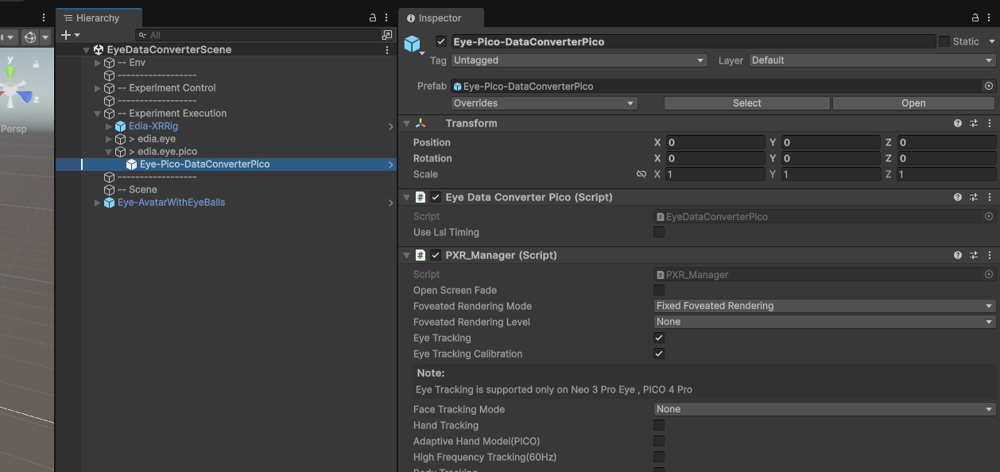

# EDIA EYE Pico 

Eye tracking support for the PICO headsets (PICO 4E, not tested for other headsets) to provide eye tracking data in the context of the [EDIA Toolbox](https://edia-toolbox.github.io). 

> [!NOTE]
> To the best of our knowledge, eye tracking in the PICO headsets only works for Android builds, not for any PC streaming (see also [here](https://mbucchia.github.io/OpenXR-Toolkit/)). 

# Features
Provides eye tracking data from a PICO headset. All samples are provided once per Unity `Update()` via the interface of the [EDIA Eye](https://github.com/edia-toolbox/edia_eye) package. The package here "only" solves the parsing into the `EDIA Eye` compatible format.   

> [!CAUTION]
> `EDIA Eye PICO` currently uses an older version of the [PICO Unity integration (v3.1.0)](https://github.com/Pico-Developer/PICO-Unity-Integration-SDK.git) and is incompatible with newer versions. As there seems to be limited interest in using the PICO headset and eye tracking support by PICO is unclear (PICO 4E was discontinued and it's unclear whether future PICO headsets will have eye tracking), we did not yet jump through all loops to make it compatible with the more recent version. Furthermore, the implementation based on `v3.1.0` of the SDK is tested in our empirical eye tracker comparison [(Klotzsche et al., 2025)](https://jov.arvojournals.org/article.aspx?articleid=2809682).  
> The current implementation thus only provides (meaningful) data for the **CENTER EYE** — no single-eye gaze data! We get and provide **Eye Openness** and **Pupil dilation** values _per eye_ though.
>   
> tl;dr **Do not use single eye gaze data from this package! Center eye = ok! Pupil and Openness for single eyes = ok**

# Detailled instructions
Please checkout our [Documentation: EDIA Pico](https://mind-body-emotion.notion.site/EDIA-Eye-Pico-12803dd4773f80f7a757ebbfe0ae5845)!

# Installation
You need: 
1. Import the [PICO Unity integration (v3.1.0)](https://github.com/Pico-Developer/PICO-Unity-Integration-SDK.git) package:
    The easiest way to install it is via the Unity Package Manager > `Add package from git` > enter: 
    ```bash
    https://github.com/Pico-Developer/PICO-Unity-Integration-SDK.git#3.1.0
    ```
    This will install `v3.1.2` which is ok. 
3. The [EDIA Core](https://github.com/edia-toolbox/edia_core/) package and its dependencies (see the installation instructions in the according README and documentation).
4. The [EDIA Eye](https://github.com/edia-toolbox/edia_eye/) package and its dependencies (see the installation instructions in the according README and documentation).
5. This package:
   The easiest way to install it is via the Unity Package Manager > `Add package from git` > enter: 
    ```bash
      https://github.com/edia-toolbox/edia_eye_pico.git?path=Assets/com.edia.eye.pico#main
    ```

# Scene setup
1. Follow the instructions on how to set up your scene as described in the ([EDIA Pico](https://mind-body-emotion.notion.site/EDIA-Eye-Pico-12803dd4773f80f7a757ebbfe0ae5845)) page.

2. Import the `Demo Scene` from the `Samples` in the `EDIA Eye PICO` package. 
   1. Open the demo scene. 
   2. In the scene -> on the `Eye-Pico-DataConverterPico` prefab, find the `PXR_Manager` component.
   3. Activate `Eye Tracking` and `Eye Tracking Calibration`
   4. Set `FaceTracking` to `None` (if you need face tracking, you need to allow `unsafe code` in the `Player Settings`)
   > <details>
   >
   > <summary>Img</summary>  
   >
   > 
   > </details>

 3. Set up the project for working with `EDIA Eye PICO`:
    1. Follow the [Setup Instructions by PICO](https://developer.picoxr.com/document/unity/complete-project-settings/) to adjust the `Project Settings`
        1. `Scripting Backend`  : `IL2CPP`
        2. `Target Architecture`  : `ARM64`
        3. [Set a `Keystore`](https://docs.unity3d.com/2022.2/Documentation/Manual/android-keystore-create.html)
    2. In `Project Settings/Player/Other/`
        1. Set `Graphics API` to `OpenGLES3` (before `Vulkan`)
        2. Set `Active Input Handling` to `Input System Package (New)`
    3. In `Build Profiles`
        1. Switch the build target to `Android`
        2. Add the Demo Scene to the `Scene List` (and remove others)
    4. [Modify the `Android manifest`.](https://www.notion.so/mind-body-emotion/EDIA-Eye-Pico-12803dd4773f80f7a757ebbfe0ae5845?source=copy_link#12803dd4773f8048be48fecfda144a12)

     
# Questions or problems?
Please reach out to us. You find contact info and our discussion board on the central repo of the [EDIA Toolbox](https://github.com/edia-toolbox/edia_core/) or via the [EDIA Toolbox website](https://edia-toolbox.github.io/).

# Citation
If you are using this repository for your research or other public work, please cite the [EDIA Toolbox](https://github.com/edia-toolbox/edia_core/).


