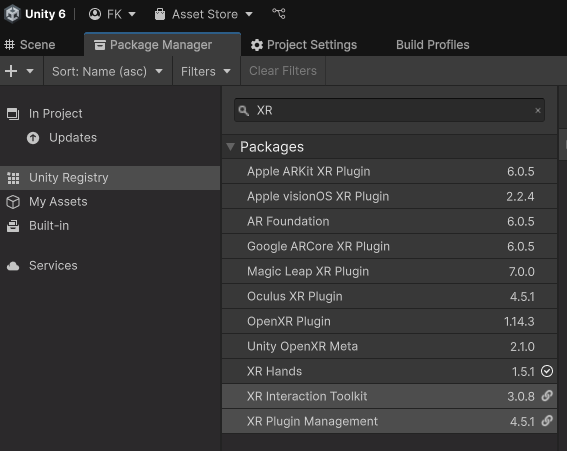

[ tbc ]  
# EDIA EYE Pico 

Eye tracking support for the PICO headsets (PICO 4E, not tested for other headsets) 


## Setting up an empty project with `EDIA Eye PICO`
### Prerequisites
1. Install (from The Unity Registry): 
   1. `XR Interaction Toolkit` (XRI) 
   2. `XR Hands`  
   <details>

   <summary>Img</summary> 

   </details>


   

3. Import Samples:
    1. Hands: → Hand Visualizer
    2. XRI: → Starter Assets & Hands Interaction Demo
2. Import the [Edia UXF fork](https://github.com/edia-toolbox/edia_uxf) package.

4. install EDIA Core

    ```bash
    git@github.com:edia-toolbox/edia_core.git?path=Assets/com.edia.core#dev
    
    ```

5. install PICO Unity integration 2.5.0

    ```bash
    https://github.com/Pico-Developer/PICO-Unity-Integration-SDK.git#3.1.0
    ```

   → `fix all` in `Project Settings -> XR Plug-in Management -> Project Validation`

6. Install [EDIA Eye](https://github.com/edia-toolbox/edia_core)

    ```bash
    git@github.com:edia-toolbox/edia_eye.git#v0.0.1
    ```

7. Install EDIA Eye Pico

    ```bash
    git@github.com:edia-toolbox/edia_eye_pico.git#v0.0.1
    ```

8. Set up project for PICO:
    1. https://developer.picoxr.com/document/unity/complete-project-settings/
        1. `Scripting Backend`  : `IL2CPP`
        2. `Target Architecture`  : `ARM64`
        3. Set `Keystore` and PW
    2. In `Project Settings/Player/Other/``
        1. Set `Graphics API` to `OpenGLES3` (before `Vulkan`)
        2. set `Active Input Handling` to `Input System Package (New)`
    3. In `Build Profiles`
        1. switch the build target to `Android`
        2. add the Demo Scene to the `Scene List` (and remove others)
9. In the scene:
    1. On the `Eye-Pico-DataConverterPico` prefab, find the `PXR_Manager`  component and activate `Eye Tracking` and `Eye Tracking Calibration`
